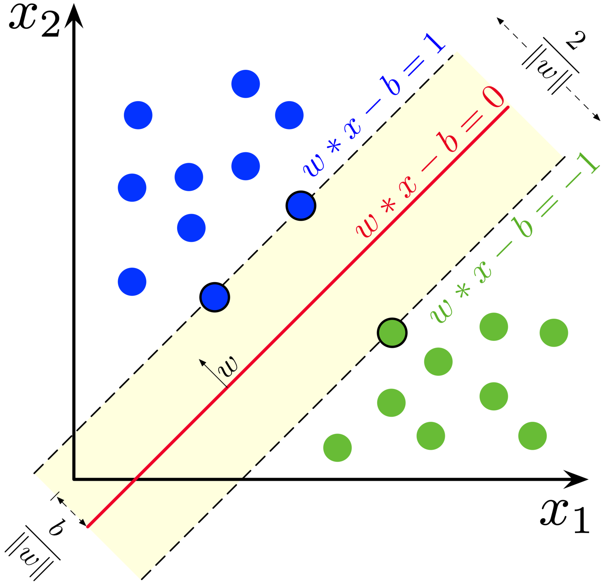
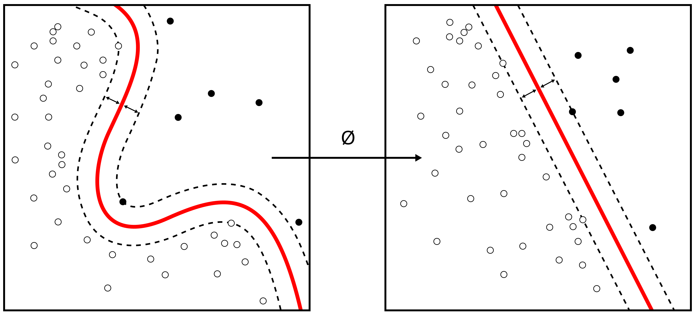

# Chapter 1: Introduction

## Types of Learning

### Supervised Learning

* trained on a dataset of labeled examples, where each example is a pair of input and output
* each input is a feature vector, and each output is a label
* the ouput could be a value from a finite set of classes, or a probability distribution over a set of classes, or a value

### Unsupervised Learning

* trained on a dataset of unlabeled examples, where each example is a feature vector

#### Clustering

* grouping of similar examples
* each example is a feature vector
* the output is a cluster label
* the cluster label is a class label
* the cluster label is a probability distribution over the classes

#### Dimensionality Reduction

* reducing the number of features in the input
* each example is a feature vector
* the output is a feature vector

#### Anomaly Detection / Outlier Detection

* each example is a feature vector
* output is a real number that indicates how x is different from a 'typical' value

#### Semi-Supervised Learning

* trained on a dataset of labeled and unlabeled examples
* same goals as supervised learning

### Reinforcement Learning

* machine learning that is used to train an agent to make decisions in an environment

## How Supervised Learning Works

### Support Vector Machines

* labels are 'binary' either -1 or 1
* goal of the algorithm is to find a hyperplane that separates the two classes
  * hyperplane is defined as wx - b = 0
  * w is a vector of weights, and b is a bias
  * thus y = sign(wx - b)
* the margin is the distance between the hyperplane and the nearest point on each class
* the 'model' in this case is given by 'w*' and 'b*'

#### Kernels

Kernels are used to transform the input into a higher dimensional space

* **linear kernel**: w = wx
* **polynomial kernel**: w = (wx)^d
* **radial basis function kernel**: w = exp(-||x - x'||^2/2sigma^2)
