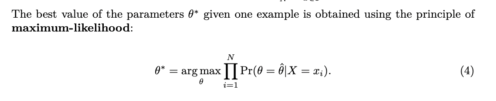

# Notation and Definitions

## 2.1 Notation

Scalars, vectors, and sets.

* scalars are denoted by a single italic letter, such as *x*, *y*, or *z*
* vectors are denoted by a bold letter, such as **x**, **y**, or **z**
  * attributes of a vector are denoted with a superscript of its index, such as *x(i)*, or *x(j)*
* sets are denoted with a capital letter **S**

This chapter continues to enumerate through pretty standard mathematical notations.

* Capital Sigma Notation
* Capital Pi Notation
* Functions

Kind of amusing that this book has a crash course of mathematics, I'm not sure a reader would be able to parse it without an existing familiarity with the subject.

* max f(a) -> returns highest value f(a) for all elements in the set
* arg max f(a) -> returns the leemnt of the set A that maximizes f(a)

## 2.5 Parameter Estimation

The maximum likelihood estimation (MLE) is the method of estimating the parameters of a statistical model by maximizing the likelihood function.

The likelihood function is the probability of the observed data given the model parameters.

## 2.6 Classification vs. Regression

* Classification: assigning a label to an unlabled example
  * binary classification: assigning a label to an unlabeled example, where the label is either -1 or 1
  * multi-class classification: assigning a label to an unlabeled example, where there are three or more classes
* Regression: predicting a real-valued label (a *target*) given an unlabeled example
  * e.g. predicting the price of a house given its features

## 2.7 Modal-Based vs. Instance-Based Learning

* SVM is a model-based learning algorithm
  * model-based uses training data to create a **model** that has **parameters** learned from the training data.
    * in SVM, **w**\* and **b**\*
* Instance-based uses the entire dataset as the model.
  * in kNN, a label is produced based on the space of feature vectors and most commonly appearing label for those *k* nearest neighbors.

## 2.8 Shallow vs. Deep Learning

* shallow learning derives parameters directly from the features of training examples
* neural networks are a type of deep learning since there are many layers of parameters