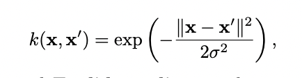

# Fundamental Algorithms

## 3.1 Linear Regression

* Collection of labeled examlpe {(x y)} with a size of the collection N, where x is the D-dimensional feature vector and y is the real-valued target

* We want to build a model f(x) where f(x) = **wx** + *b*

* loss function -> measures the difference between the model and the target
* squared error loss -> (f(x) - y)2
* binary loss -> 1 if f(x) - y > 0 else 0

Within linear regression, the average loss is also called empirical risk

* Overfitting -> matches examples from the training data but has failed to capture the underlying structure of the data

## 3.2 Logistic Regression

Hinges on there being a positive label 1 and a negative label 0 and we then can build a single function with a codomain of (0,1).

f(x) = 1 / (1 + e-x)

The above is the standard logistic function / sigmoid function.

f(x) = 1 / (1 + e-(wx + b))

The logistic regression model. Its optimization criterion is referred to as maximum likelihood.

Gradient descent is used to find the parameters of the model but is not discussed in this chapter.

## 3.3 Decision Tree Learning

A decision tree operates via branching from a root node, each 'branch' is a feature *i* and each 'leaf' is a class label.

* Fair to say you could view it as a series of if-else statements

There are various ways to build a decision tree, the example included here is ID3 (Iterative Dichotomiser 3).

### ID3 Optimization

### ID3 Building Algorithm

In building the decision tree, we start with the root node and then recursively split the data into two groups based on the value of the feature.

We evaluate the 'quality' of the split via its 'entropy', the degree of uncertainty about a random variable. We try to find the value of the feature that minimizes the entropy, or that maximizes the information gain.

## 3.4 Support Vector Machine

Mentioned before, but it is important to note a couple cases where the SVM is not appropriate: when the data is not linearly separable. This could be due to noise (outliers) or a non-linear relationship between the features and the target.

### 3.4.1 Dealing with Noise

The **hinge loss function** is used to deal with noise. It is defined as:

f(x) = max(0, 1 - yi (**w**xi - *b*)

We then try to minimize the cost function: 

C ||w||2 + 1/N sumi=1N max(0, 1 - yi (**w**xi - *b*))

As C decreases, the SVM will shrink the margin between the two classes in order to reduce the error and accommodate noise. Reducing the margin reduces the generalization captured by the model.

### 3.4.2 Dealing with Non-Linearity

SVMs can use a function to 'implicitly' "transform the original space into a higher dimenion space." This is done via the 'kernel trick.' We don't inherently know what the kernel function must be for a given data set.

The generalized approach to solving this optimiziation problem is *Lagrange multipliers.*

There are multiple kernel functiosn that can be used, but the most commonly used is the **radial basis function kernel.**

## 3.5 K-Nearest Neighbors

Intuitively named, this algorithm is used to find the most commonly occurring label for a given feature vector via its 'closeness.' *Cosine similarity* is a popular metric used to measure the similarity between two vectors.

