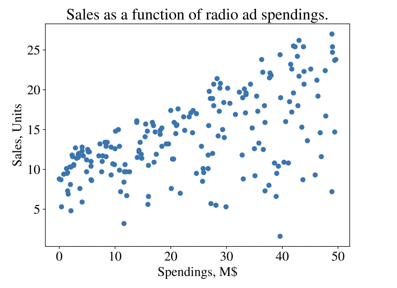
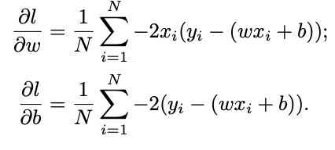

# Anatomy of a Learning Algorithm

## 4.1 Building Blocks of a Learning Algorithm

* a loss functio
* an optimization criteria based on the loss function (e.g. a cost function)
* an optimization routine utilizing training data and optimization criteria

Most common examples:

* gradient descent
* stochastic gradient descent

## 4.2 Gradient Descent

Given the training data, a griadient descent algorithm begins by "calculating the partial derivative for every parameter."

Initializing each parameter at 0,k we can then iterate through every example. Each parameter is then updated using the partial derivates and the learning rate.

Generalized code from the book is provided in the `gradient_descent.py` file.

## 4.3 How Machine Learning Engineers Work

A short section which just explains that in practice you tend to import libraries which implement the algorithms for you.

## 4.4 Learing Algorithms' Particularities

Breaks down the differences between the various learning algorithms.

* Decision tree learning -> accepts categorical features
* SVMs -> allow the data analyst to provide weights for each class
* SVMs and kNNs -> output only the class given the feature vector
* decision tree learning, logistic regression, SVM -> build the model using the whole dataset
* deicision tree learning, SVM, kNN -> can be used for both classification and regression
