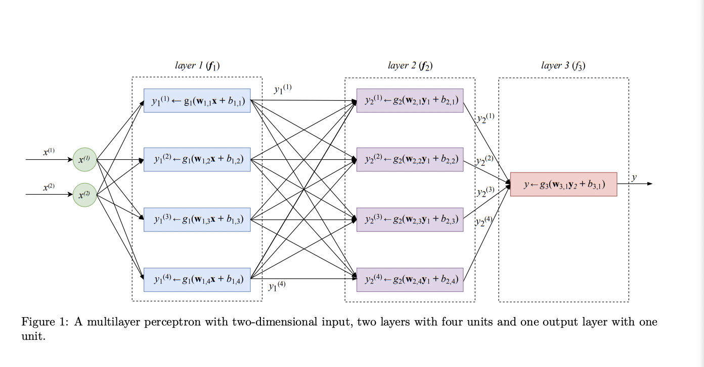
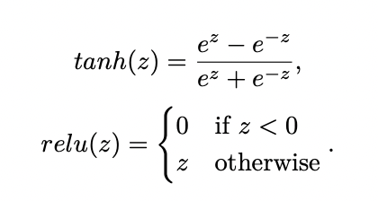
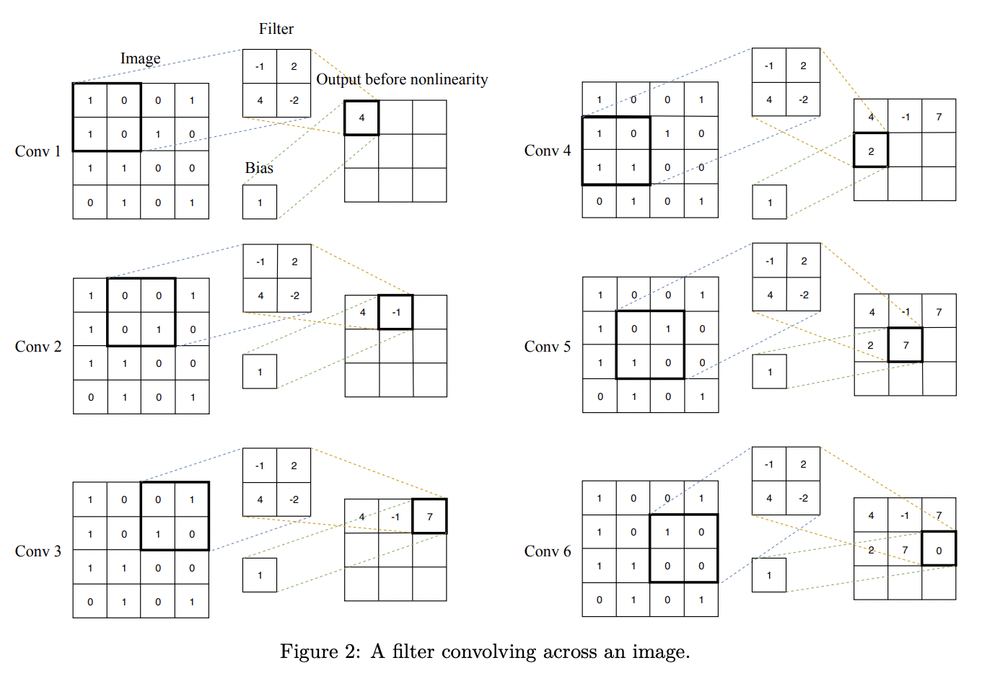
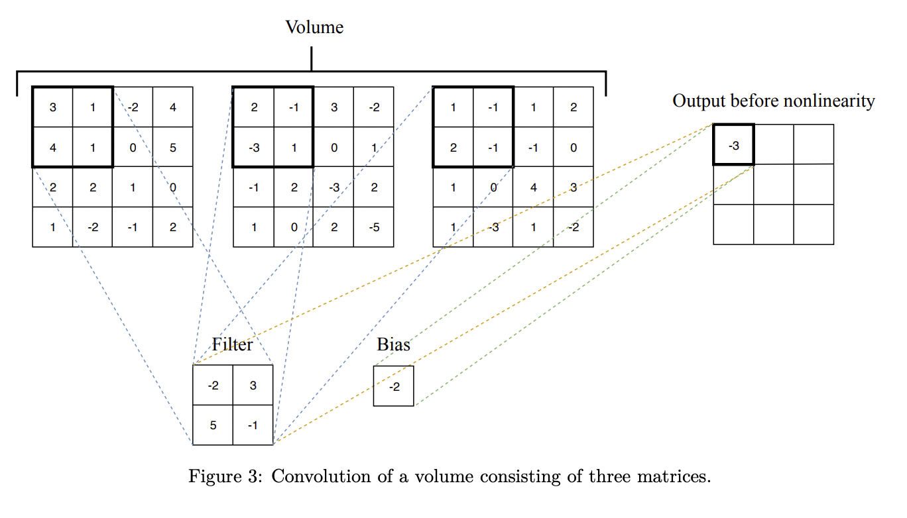
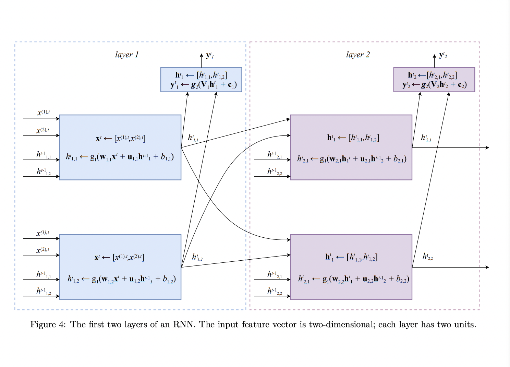

# Neural Networks and Deep Learning

## 6.1 Neural Networks

Nested functions are used to represent a neural network.

* Activation function: a fixed, usually nonlinear function chosen by the
data analyst before the learning is started

Neural networks utilize matrices rather than vectors.

A multilayer perceptron is sometimes referred to as a 'vanilla' neural network.

### 6.1.1 Multilayer Perceptron Example

A multilayer perceptron (MLP) is one example of a feed-forward neural network (FFNN).

This book defines a 'vanilla' neural network as one in which a layer's output value, a real number, becomes the input value to the next layer.

The architecture shown above is also described as 'fully connected', because each layer is fully connected to the next layer.

### 6.1.2 Feed-Forward Neural Network Architecture

The final layer's activation function (g) determines what sort of model we are utilizing. If g is linear, then we are using a linear regression model. If g is logistic, then we are using a binary classification model.

Activation functions are typically used to introduce non-linearity into a model. Without them, no matter how many layers we add, the model would be linear.

Popular activation functions include:

* the logistic function
* TanH
* ReLU

## 6.2 Deep Learning

Term for networks with more than two non-output layers.

Challenges for these models include exploding gradient and vanishing gradient. Exploding gradient was solved via gradient clipping and L1 and L2 regularization.

Vanishing gradient, by comparison, took longer to solve. This was due to these very small gradient values making early layers in the network unable to learn.

Non input or output layers are called 'hidden layers.'

### 6.2.1 Convolutional Neural Networks

A Convolutional Neural Network (CNN) attempts to address the issue of increasing dimensionality by using convolutional filters, each with their own bias. It is especially useful for image processing.

If multiple convolution layers are adjacent, the subsequent layer treats the previous layer as a collection of image matrices, also called a volume.

### 6.2.2 Recurrent Neural Networks

A Recurrent Neural Network (RNN) is a type of neural network that is designed to handle sequential data. It is by definition not a feed-forward network because it has loops.

Each layer of an RNN can have a state of real value.

