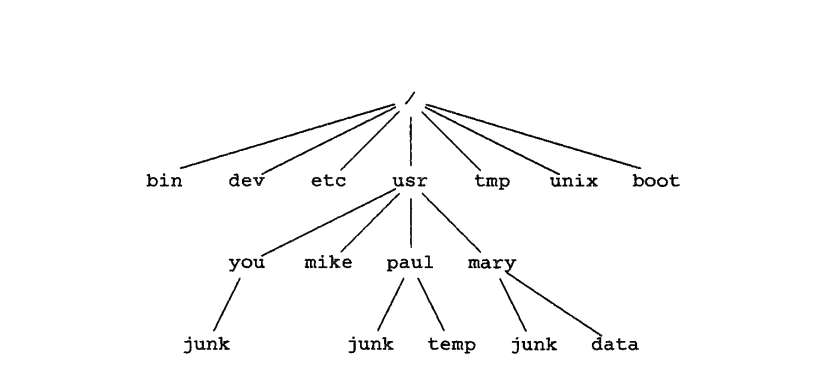
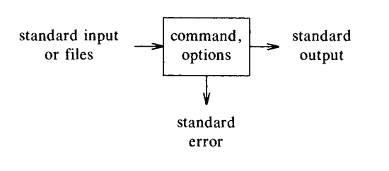

# Unix For Beginners

## 1.1 Getting started

Basic commands:

```bash
    date
    who
    mail
```

Command for 'set terminal options'

```bash
    stty
```

\ to escape a character

Some old unix systems provided a `news` and `learn` commands

Prefix a command with `man` to get a manual page

## 1.2 Day-to-day use: files and common commands

`vi` and `emacs` were the most common text editors

`ed` is an older editor with basic commands similar to `vi`

```bash
    ed {name} # opens the editor, name is optional
    a         # (append) command to add text
    .         # command to save changes
    w {name}  # (write) command to save changes to a file
    q         # command to quit
```

### `ls`

List files in current directory

```bash
    ls
    ls -t # sort by time, last changed first
    ls -l # 'long' format, shows permissions, owner, group, size, date, and name
    ls -u # adds info on when file was last accessed
    ls -r # reverses the order of the list
```

Options can be combined, e.g. `ls -lut`

### `cat`

Prints the contents of a file

```bash
    cat {name} # prints the contents of the file
    cat {name1} {name2} # prints the contents of the files
```

### `pr`

Prints the contents of a file with a standard format for printers. Each page is 66 lines.

```bash
    pr {name} # prints the contents of the file
    pr {name1} {name2} # prints the contents of the files
```

There are also options for 'high speed printers,' `lpr`, and 'line printers,' `lp`.

### `mv`, `cp`, `rm`

Move, copy, and remove files

```bash
    mv {name1} {name2} # move file
    cp {name1} {name2} # copy file
    rm {name1} {name2} # remove file
```

`mv` will replace the file if it already exists.

### `wc`

Counts the number of lines, words, and characters in a file

```bash
    wc {name} # prints the number of lines, words, and characters in the file
```

Options:

* `-l` prints the number of lines
* `-w` prints the number of words
* `-c` prints the number of characters

### `grep`

Searches for a pattern in a file. Name comes from the `ed` command `g/regular-expression/p`.

```bash
    grep {pattern} {name} # prints all lines that contain the pattern
    grep -v {pattern} {name} # prints all lines that do not contain the pattern
```

Options:

* `-i` case insensitive
* `-v` prints all lines that do not contain the pattern
* `-w` prints all lines that contain the pattern

### `sort`

Sorts its input into alphabetical order line by line

```bash
    sort -r  # reverse normal order
    sort -n  # sort in numberic order
    sort -nr # sort in reverse numberic order
    sort -f  # fold upper and lower case together
    sort +n  # sort starting at n+1st field
```

### `tail`

Prints the last 10 lines of a file

```bash
    tail    # prints the last 10 lines of the file
    tail -1 # prints the last line of the file
    tail +3 # prints the 4th line of the file to the end
```

### `cmp`

Compares two files and finds the first difference, e.g.:

```bash
    $ cmp file new_file
    file new_file differ: char 3, line 2
    $
```

### `diff`

Comapres contets of two text files and prints the differences, e.g.:

```bash
    $ diff file new_file
    < file
    ---
    > new_file
    3c3
    < This is a line
    ---
    > This is a new line
    $
```

## 1.3 More about files: directories

### Your current directory -- `pwd`

'print working directory'

```bash
    $ pwd
    /usr/you
    $
```

For my own amusement, the file system example from the book is:



### Changing directory -- `cd`, `mkdir`, `rmdir`

These are familiar, so just some examples:

```bash
    $ mkdir book
    $ cd book
    $ pwd
    /usr/you/book

    $ cd ..
    $ pwd
    /usr/you
```

Remember, `cd` with no arguments changes to your home directory.

Finally, to remove a directory, use `rmdir`

```bash
    $ mkdir book
    $ mkdir movie
    $ rmdir book
    $ ls
    movie
```

## 1.4 The shell

Assuming a series of files `ch1.1.md`, `ch1.2.md`, etc., the shell contains series of services that can be used to manipulate files and directories.

If you wanted to list the contents of every chapter of your book, you could do:

```bash
    $ pr ch*.md
    # Contents of ch1.1.md...
    # Contents of ch1.2.md...
    # Contents of ch1.3.md...
```

Or if you wanted a word count of every chapter:

```bash
    $ wc ch*.md
    # Word count of ch1.1.md...
    # Word count of ch1.2.md...
    # Word count of ch1.3.md...
```

You can do more advanced pattern matching with `*` using `[]`:

```bash
    $ pr ch[12346789]*.md # prints all chapters but excludes any that start with 'ch5'
    # Contents of ch1.1.md...
    $ pr [1-46-9]*        # does the same thing
    # Contents of ch1.1.md...
    $ rm temp[a-z]        # remove any of `tempa`, ..., `tempz` that exist
```

The `?` pattern matches any single character:

```bash
    $ ls ?        # prints all files with single-character names
    a
    b
    c
    ...
    $ ls ch?.1    # list ch1.1 ch2.1 ch 3.1 but would miss ch10.1
    ch1.1  ch2.1  ch3.1
    $ rm temp?    # remove any of temp1, tempaz, ...
```

### Input-output redirection

To print the list of filenames to a file:

```bash
    ls >filelist.txt
```

To capture the output of `cat` into a file, combining their contents:

```bash
    cat file1 file2 file3 >temp
```

Similarly, `>>` appends to a file whilst `>` overwrites it

```bash
    cat file4 file5 file6 >>temp
```

`<` means to read the contents of a file into the shell, potentially for a command:

```bash
    mail mary joe tom bob <letter
```

Let's print an alphabetical list of users:

```bash
    who >temp
    sort <temp
```

Or to count users:

```bash
    who >temp
    wc -l <temp
```

### Pipes

Instead of using a series of commands, you can use a single command to do the same thing with piping:

```bash
    who | sort        # Print sorted list of users
    who | wc -l       # Count number of users
    ls | wc -l        # Count number of files
    ls | pr -3        # 3-column list of filenames
    who | grep mary   # Look for a particular user, 'mary'
```

You can use as many pipes as you like:

```bash
    ls | pr -3 | 1pr        # creates a 3-column list of filenames on the line printer
    who | grep mary | wc -l # counts how many times 'mary' is logged in
```

### Command invocation

Generally can be represented as:

`command [options] [arguments]`

Or, pictographically:



### Processes

Semicolons can be used to separate commands:

```bash
    ls; ls -l; ls -l -a
```

Commands are executed sequentially.

To run a command in the background, use `&`, such as for counting the number of characters in a book:

```bash
    $ wc ch* >wc.out &
    6944                # Process ID printed by the shell
    $
```

The command `wait` exists to wait for all processes have finished, `kill` can be used to kill a process by its ID.

`kill 0` will kill all processes.

To view currently running processes, you can use `ps`:

```bash
    $ ps -ag
      PID TTY          TIME CMD
     1234 pts/0    00:00:00 bash
     5678 pts/0    00:00:00 wc
     8901 pts/0    00:00:00 ps
```

NOTE: The above is out of date, but the `ps` command is still used with additonal arguments.

You can use the command `nohup` to run a command in the background and without being interrupted by 'hangup' signals.

`nice` can be used to run a command with a lower priority.

`at {time}` can be used to schedule a command to run at a particular time.

### Tailoring the environment

"If there is a file named `.profile` in your login directory, the shell will execute command in it when you log in"

### Paths

The shell uses a 'path' to find commands.

There are a few ways to define this:

```bash
    PATH=.:/bin:/usr/bin:/usr/games
    PATH=$PATH:/usr/local/bin
```

It seems scary, but it's not. The shell will look for commands in the directories in the path, in order.
