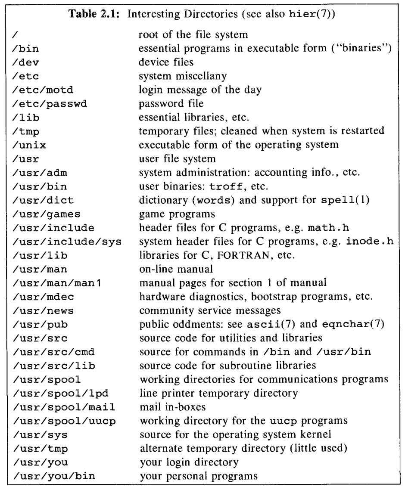

# THE FILE SYSTEM

## 2.1 The basics of files

```bash
    $ ed
    a
    now is the time
    for all good people
    .
    w junk
    36
    q
    & ls -l junk
    -rw-r--r-- 1 you you 36 May 15 15:00 junk
```

This `36` is the number of bytes in the file, the 36 characters typed into it in this case.

The command `od` (octal dump) prints a visual representation of each byte in the file:

```bash
    $ od -c junk
    0000000   n   o   w        i   s        t   h   e        t   i   m   e  \n
    0000020   f   o   r        a   l   l        g   o   o   d        p   e   o
    0000040   e   o   p   l   e   \n
    0000044
    $
```

Another option for `od` is `-b` which will print the octal values as well for each character.

In the above, `\n` is a newline character. Backspace is `\b`, and tab is `\t`, return is `\r`, and so on.

`cat -u` 'unbuffers' the output, so that it is printed immediately. Additionally, using *ctrl-d* immediately sends typed characters to the program reading from the terminal.

## 2.2 What's in a file?

Interestingly, Unix's `file` does not rely exclusively on file suffixes to determine the type of file. Instead, it reads the first few hundred bytes. A runnable program is marked with a binary 'magic number' at the beginning of the file.

*"In UNIX systems there is just one kind of file, and all that is required to access a file is its name."*

Most files are considered 'text' files, and are treated as such by default. And so most programs will run on 'text' files rather than have any ability to process binary files.

## 2.3 Directories and filenames

This section begins with a general overview of the tree structure of a Unix file system.

The command `du` (disk usage) can be used to see the disk usage of a directory.

```bash
    $ du
    6       ./recipes/pie
    4       ./recipes/cookie
    11      ./recipes
    13      .
    $
```

Each number represents a disc block, either 512 or 1024 bytes in size.

`du -a` can be piped through `grep` to find specific files

```bash
    $ du -a | grep choc
    3       ./recipes/chookie/choc.chip
    $
```

`od -cb` can be used to see all bytes in a directory.

"A directory consistes of 16-byte chunks, the last 14 of which hold the filename, padded wth ASCII NUL's (which have value 0) and the first two of which tell the system where teh administrative information for the file resides."

## 2.4 Permissions

Reading a permission string like `-rw-r--r--`:

`-` indicates this is an ordinary file
`rw-` means the `root` (owner) can read, write, but not execute
`r--` means those in the `adm` group, generally admin, can only read
`r--` means everyone else can only read

`chmod` is used to change the permissions of a file.

```bash
    chmod 666 junk
```

"The octal modes are specified by adding together a 4 for read, 2 for writer, and 1 for execute."

## 2.5 Inodes

"The administrative information is stored in the inode along with essential system data such as how long it is, where on the disc the contents of the file are stored, and so on."

"It is important to understand inodes, not only to appreciate the options on `ls`, but because in a strong sense the inodes *are* the files. All the directory hierarchy does is provide convenient names for files. The system's internal name for a file is its *i-number*: the number of the inode holding the file's information. `ls -i` reports the i-number in decimal."

"A filename in a directory is therefore called a *link*, because it links a name in the directory hierarchy to the inode, and hence to the data."

There is then a breakdown of the typical directors within a Unix system.


